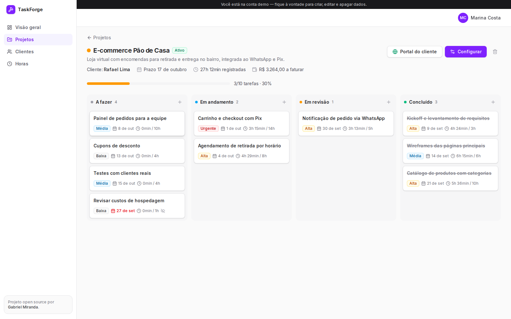
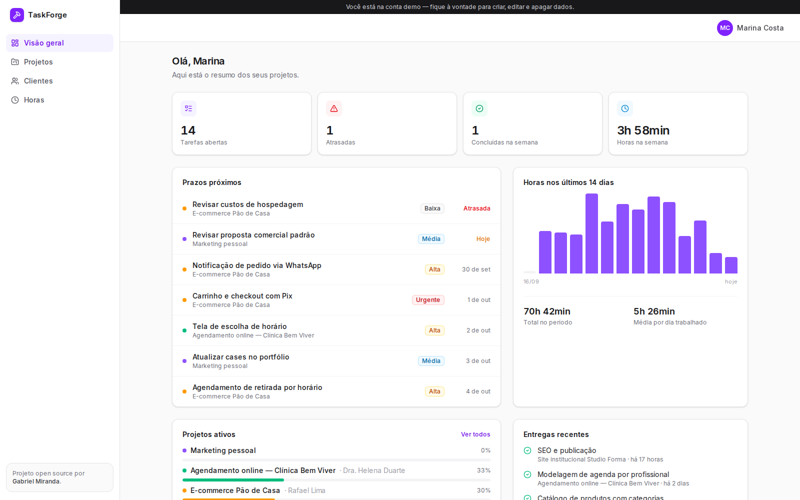

# TaskForge


**Project and delivery management for freelancers and small teams.** Plan work on a kanban board,
track time per task, keep clients organized and send each client a read-only link to follow the
project — no spreadsheets, no "any updates?" messages.



> **Try it:** open the app and click **"Explorar com a conta demo"** — the demo account comes with
> clients, projects, tasks and two weeks of time entries. (`demo@taskforge.dev` / `demo1234`)

## Features

| | |
| --- | --- |
| **Kanban per project** | Drag and drop between *A fazer → Em andamento → Em revisão → Concluído* (mouse and keyboard), priority, due date and estimate on every card. Optimistic updates with rollback on error. |
| **Time tracking** | One-click timer per task (only one runs at a time, visible in the header on every page) or manual entries. |
| **Client portal** | Generate a public, unguessable link with project progress. Internal tasks can be hidden from the client. Revoke it any time. |
| **Dashboard** | Open/overdue tasks, deliveries this week, upcoming deadlines, hours in the last 14 days. |
| **Clients & billing** | Clients with contacts and projects; optional hourly rate per project to show the amount to invoice. |
| **Hours report** | Totals per project and period, CSV export ready for Excel (pt-BR separators). |



## Architecture

```
Browser ──► Next.js App Router (React Server Components)
              │  reads:   src/lib/queries.ts  ──► Prisma ──► PostgreSQL
              │  writes:  src/lib/actions.ts  (Server Actions, Zod-validated)
              └─ proxy.ts (Auth.js) guards every /app route before it renders
```

- **No separate REST layer.** Pages are Server Components that call typed query functions;
  mutations are Server Actions. Less code, no client-side data fetching boilerplate, no token
  ever reaches the browser.
- **Ownership is enforced in every query.** Every read and write filters by the signed-in user
  (`project.ownerId`), so guessing an ID never exposes someone else's data.
- **Board ordering** uses fractional positions (`position` is a float): moving a card writes one
  row instead of renumbering a whole column.
- **Time entries** are open (`endedAt = null`) while the timer runs; starting a new timer closes
  the previous one, so there is never more than one running per user.
- **Client portal** is a public route (`/share/[token]`) that only selects safe fields and tasks
  flagged `clientVisible`.

## Running locally

Requirements: Node.js 20+, Docker.

```bash
cp .env.example .env.local        # then set AUTH_SECRET (npx auth secret)
npm install
npm run setup                     # starts Postgres, applies migrations, seeds the demo account
npm run dev                       # http://localhost:3101
```

`npm run db:seed` resets the demo account at any time.

## Scripts

| Script | What it does |
| --- | --- |
| `npm run dev` / `build` / `start` | Next.js dev server, production build, production server |
| `npm run check` | ESLint + TypeScript |
| `npm run setup` | Postgres (Docker) + migrations + demo seed |
| `npm run db:migrate` | Create/apply a migration in development |

## Deploy

Works on Vercel with any Postgres (Neon, Supabase, RDS). Set `DATABASE_URL`, `AUTH_SECRET` and
`NEXT_PUBLIC_APP_URL`, run `npm run db:deploy` and `npm run db:seed` once.

## Stack

Next.js 16 · React 19 · TypeScript · Prisma 7 · PostgreSQL · Auth.js v5 · Zod · dnd-kit ·
Tailwind CSS 4 · Radix UI · date-fns

---

Built by [Gabriel Miranda](https://www.letinfo.dev) · MIT License
